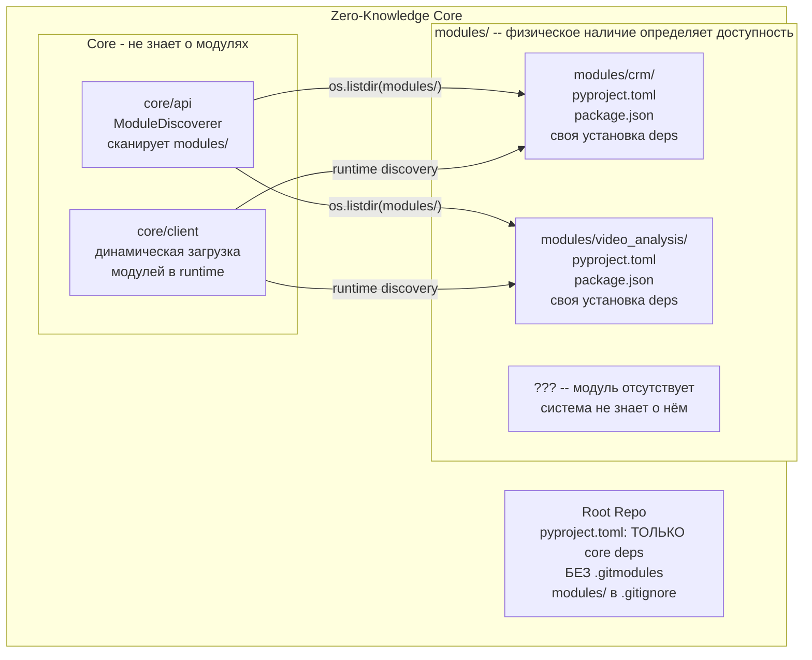
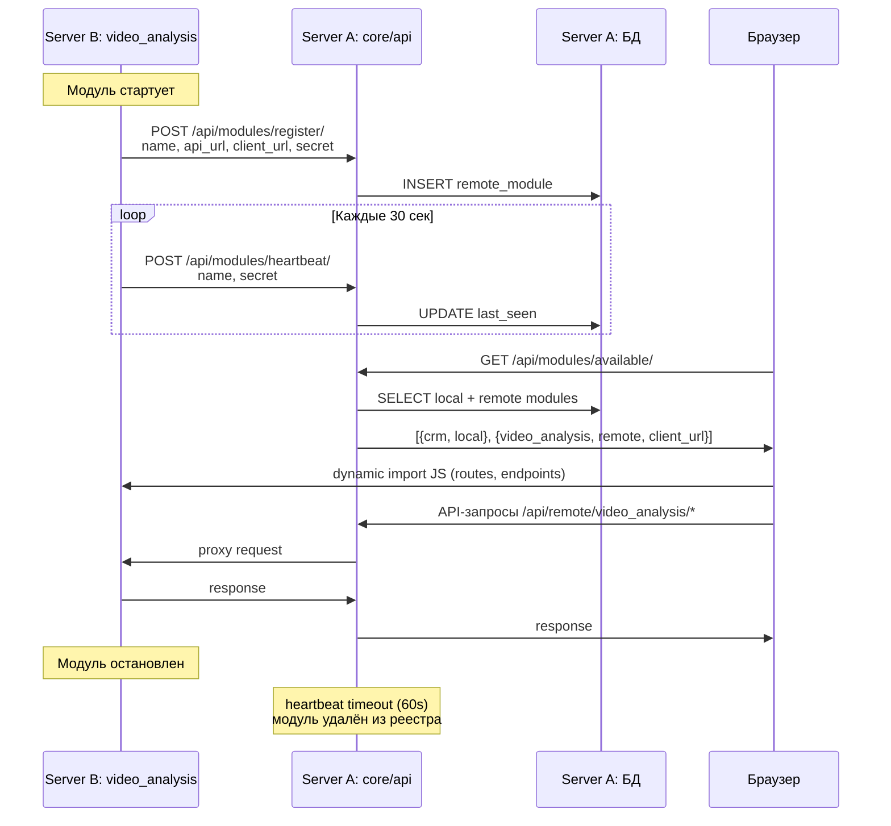

# Plugin-архитектура ERGO MS с конфиденциальностью модулей

## Главный принцип: Zero-Knowledge Core

**Ядро не знает ничего о конкретных модулях.** Ни один файл в `core/` или в корне проекта не содержит имён, зависимостей или ссылок на конкретные модули. Модуль -- это папка в `modules/`, и если она есть на диске, система её автоматически подхватывает; если нет -- система о ней не знает.




---

## Диагностика текущих утечек информации о модулях

Сейчас ядро "знает" о модулях в 4 местах:

### 1. `.gitmodules` -- перечисляет ВСЕ 18+ модулей по имени и URL

Файл [.gitmodules](.gitmodules) содержит 23 submodule (5 core + 18 модулей), включая URL каждого репозитория. Любой, кто имеет доступ к root-репозиторию, видит полный список всех модулей и их GitHub-адреса. Кроме утечки информации, git submodules создают сложности при клонировании, обновлении и работе в CI.

### 2. `pyproject.toml` -- содержит зависимости ВСЕХ модулей

Файл [pyproject.toml](pyproject.toml) содержит 97 зависимостей, включая модуль-специфичные:

- `torch`, `torchvision`, `torchaudio` -- только video_analysis/porosity_analysis
- `vosk`, `moviepy`, `opencv-python` -- только video_analysis
- `yfinance`, `feedparser` -- только assets_analysis
- `mysqlclient`, `pyodbc`, `pymssql` -- только модули с внешними БД

По набору зависимостей можно восстановить, какие модули существуют.

### 3. Frontend `import.meta.glob` -- сканирует в build-time

Файл [ModuleLoader.js](core/client/src/modules/core/ModuleLoader.js) использует:

```javascript
modulesRoutes: import.meta.glob('../../../../../modules/*/client/js/routes.js', { eager: true })
```

Это Vite build-time glob: все найденные модули **вкомпилируются в JS-бандл**. Если на машине сборки есть все модули, то в production-бандле будут ссылки на все модули.

### 4. `package.json` workspaces -- паттерн `modules/*/client`

Файл [package.json](package.json) содержит:

```json
"workspaces": ["core/client", "modules/*/client"]
```

Сам паттерн безопасен (глоб), но `npm install` на машине со всеми модулями создаст записи в `node_modules` для всех.

---

## Фаза 1: Полный отказ от git submodules

**Проблема**: `.gitmodules` перечисляет все 18+ модулей по имени и URL. Кроме того, git submodules создают сложности при клонировании, обновлении и CI.

**Решение**: Удалить `.gitmodules` полностью. Core-компоненты становятся частью основного репозитория. Модули клонируются независимо.

### 1.1. Поглотить core submodules в основной репозиторий

Core-компоненты (`core/api`, `core/client`, `core/media_api`, `core/django`, `core/django_rest_framework`) перестают быть submodules и становятся обычными директориями в основном репозитории:

```bash
# Для каждого core-submodule:
git rm --cached core/api
rm -rf .git/modules/core/api
# Затем git add core/api как обычную директорию
git add core/api
```

После этого `.gitmodules` можно удалить полностью:

```bash
git rm .gitmodules
```

Вся история core-компонентов сохраняется в их отдельных репозиториях на GitHub, но в root-репозитории они теперь просто директории.

### 1.2. Добавить `modules/` в `.gitignore`

```gitignore
# Модули подключаются отдельно, клонируются независимо
modules/
!modules/.gitkeep
```

Пустой `modules/.gitkeep` гарантирует, что директория существует при клонировании root-репозитория.

### 1.3. Модули клонируются независимо

Каждый модуль -- это отдельный git-репозиторий. Установка на конкретный сервер:

```bash
# Только авторизованные пользователи знают URL
cd modules/
git clone https://github.com/SKB-AI/ergo_ms_video_analysis.git video_analysis
```

Или через ergoms CLI:

```bash
ergoms install-module video_analysis --repo https://github.com/SKB-AI/ergo_ms_video_analysis.git
```

### 1.4. Приватный реестр модулей (опционально)

Для управления доступом создать `modules-registry.yaml` (НЕ в root-репозитории, а на отдельном сервере/в приватном репозитории):

```yaml
# Хранится ОТДЕЛЬНО, не в core
modules:
  video_analysis:
    repo: https://github.com/SKB-AI/ergo_ms_video_analysis.git
    access_level: confidential
    required_gpu: true
  crm:
    repo: https://github.com/SKB-AI/ergo_ms_crm.git
    access_level: public
```

---

## Фаза 2: Изоляция Python-зависимостей

**Проблема**: единый `pyproject.toml` содержит зависимости всех модулей.

### 2.1. Очистить корневой `pyproject.toml`

Оставить ТОЛЬКО зависимости, необходимые для ядра:

```toml
[tool.poetry]
name = "ergo_ms_api"
version = "0.1.0"
packages = [
    {include = "src", from = "core/api"},
    {include = "commands", from = "core/api"},
    {include = "rest_framework", from = "core/django_rest_framework"},
    {include = "django", from = "core/django"},
    # НЕТ {include = "modules"} -- модули подключаются динамически
]

[tool.poetry.dependencies]
python = ">=3.12,<3.13"
# --- ТОЛЬКО core-зависимости ---
django = {path = "core/django", develop = true}
djangorestframework = {path = "core/django_rest_framework", develop = true}
django-cors-headers = ">=4.7.0"
djangorestframework-simplejwt = ">=5.5.0"
drf-yasg = ">=1.21.10"
daphne = ">=4.2.1"
celery = ">=5.5.3"
channels = ">=4.2.2"
psycopg2 = ">=2.9.10"
django-environ = ">=0.12.0"
pyyaml = ">=6.0.2"
whitenoise = ">=6.9.0"
psutil = ">=7.0.0"
numpy = ">=2.1.3"
pandas = ">=2.3.1"
setuptools = ">=80.9.0"
sqlalchemy = ">=2.0.41"
django-celery-beat = ">=2.8.1"
django-filter = ">=25.1"
django-extensions = ">=4.1,<5.0"
requests = ">=2.31.0,<3.0.0"
# НЕТ torch, tensorflow, vosk, opencv, yfinance и т.д.
```

### 2.2. Каждый модуль получает свой `pyproject.toml`

Пример `modules/video_analysis/pyproject.toml`:

```toml
[tool.poetry]
name = "ergo-module-video-analysis"
version = "0.1.0"
packages = [{include = "api"}]

[[tool.poetry.source]]
name = "pytorch-cu128"
url = "https://download.pytorch.org/whl/cu128"
priority = "explicit"

[tool.poetry.dependencies]
python = ">=3.12,<3.13"
# Модуль-специфичные зависимости
torch = {version = "==2.7.1+cu128", source = "pytorch-cu128"}
torchvision = {version = "==0.22.1+cu128", source = "pytorch-cu128"}
torchaudio = {version = "==2.7.1+cu128", source = "pytorch-cu128"}
opencv-python = ">=4.12.0.88"
vosk = ">=0.3.45,<0.4.0"
moviepy = "==1.0.3"
scikit-image = ">=0.25.2"

[build-system]
requires = ["poetry-core>=2.1.3"]
build-backend = "poetry.core.masonry.api"
```

### 2.3. Автоматическая установка зависимостей модуля

При обнаружении модуля в `modules/`, система автоматически устанавливает его зависимости.

Добавить в `ergoms` CLI команду:

```bash
# Устанавливает зависимости всех найденных модулей
ergoms install-modules

# Внутренне для каждого modules/*/pyproject.toml:
# cd modules/video_analysis && poetry install --no-root
```

Добавить в `ModuleDiscoverer` проверку:

```python
def _ensure_module_deps_installed(self, module_path: str) -> bool:
    """Проверяет наличие pyproject.toml в модуле и устанавливает зависимости."""
    pyproject = os.path.join(module_path, 'pyproject.toml')
    if os.path.exists(pyproject):
        # Проверить marker-файл .deps_installed
        marker = os.path.join(module_path, '.deps_installed')
        if not os.path.exists(marker):
            logger.warning(f"Модуль {module_path} требует установки зависимостей. "
                          f"Запустите: ergoms install-modules")
            return False
    return True
```

### 2.4. Добавить `modules` в Poetry path для import resolution

В корневом `pyproject.toml`:

```toml
[tool.poetry]
packages = [
    {include = "src", from = "core/api"},
    {include = "commands", from = "core/api"},
    {include = "rest_framework", from = "core/django_rest_framework"},
    {include = "django", from = "core/django"},
]
# Модули НЕ перечислены -- они добавляются в sys.path динамически
```

В `settings/base.py` добавить динамическое расширение `sys.path`:

```python
import sys
# Динамически добавлять найденные модули в Python path
for module_dir in MODULES_DIR.iterdir():
    if module_dir.is_dir() and (module_dir / 'api').is_dir():
        sys.path.insert(0, str(module_dir))
```

---

## Фаза 3: Хук автоустановки в ergoms CLI

Добавить в `core/deployment/commands.conf`:

```conf
# Установка зависимостей модулей
install-modules=shell:python core/api/src/core/utils/module_installer.py
```

Создать `core/api/src/core/utils/module_installer.py`:

```python
"""
Скрипт автоматической установки зависимостей модулей.
Сканирует modules/ и для каждого модуля с pyproject.toml
запускает poetry install.
"""
import os
import subprocess
from pathlib import Path

MODULES_DIR = Path(__file__).resolve().parents[5] / 'modules'

def install_module_deps():
    for module_dir in sorted(MODULES_DIR.iterdir()):
        if not module_dir.is_dir():
            continue
        pyproject = module_dir / 'pyproject.toml'
        if pyproject.exists():
            print(f"[MODULE] Installing deps for {module_dir.name}...")
            subprocess.run(
                ['poetry', 'install', '--no-root'],
                cwd=str(module_dir),
                check=True
            )
            # Создаём marker
            (module_dir / '.deps_installed').touch()

if __name__ == '__main__':
    install_module_deps()
```

---

## Фаза 4: Frontend -- динамическая загрузка модулей в runtime

**Проблема**: `import.meta.glob` -- это build-time механизм Vite. Все модули, найденные на диске в момент сборки, вкомпилируются в бандл. Если на билд-сервере есть все модули, они все окажутся в JS-бандле.

### 4.1. Вариант A: Сборка per-deployment (простой)

Если frontend собирается на том же сервере, где он будет работать, текущий `import.meta.glob` подход уже работает корректно: он подхватит только те модули, которые физически есть в `modules/`.

**Это безопасно при условии**: сборка происходит на целевом сервере или в CI-пайплайне с правильным набором модулей.

### 4.2. Вариант B: Runtime Module Discovery (рекомендуемый)

Заменить build-time globs на runtime API-вызов, который отдаёт список доступных модулей и их ресурсов.

**Шаг 1**: Добавить API-эндпоинт в core, возвращающий список модулей:

```python
# core/api/src/core/utils/views.py
class AvailableModulesView(APIView):
    """Возвращает список модулей, установленных на этом сервере."""
    
    def get(self, request):
        discoverer = ModuleDiscoverer()
        modules = discoverer.discover_client_route_modules()
        return Response({
            'modules': [
                {
                    'name': key,
                    'has_routes': True,
                    'has_endpoints': os.path.exists(...),
                    'has_menu': os.path.exists(...),
                }
                for key, path in modules.items()
            ]
        })
```

**Шаг 2**: В `ModuleLoader.js` заменить `import.meta.glob` для external-модулей на dynamic import:

```javascript
// БЫЛО (build-time -- все модули вкомпилированы):
modulesRoutes: import.meta.glob('../../../../../modules/*/client/js/routes.js', { eager: true })

// СТАЛО (runtime -- загружаются только модули текущего сервера):
async loadExternalModulesRuntime() {
  const response = await fetch('/api/utils/available-modules/')
  const { modules } = await response.json()
  
  const loaded = {}
  for (const mod of modules) {
    if (mod.has_routes) {
      // Dynamic import -- загружает JS модуля только если он есть
      const routes = await import(`/modules/${mod.name}/client/js/routes.js`)
      loaded[mod.name] = routes.default
    }
  }
  return loaded
}
```

**Шаг 3**: Настроить Vite для раздачи модульных JS-файлов как статических:

```javascript
// vite.config.js
export default {
  server: {
    fs: {
      allow: ['../../modules']  // Разрешить доступ к модулям
    }
  },
  build: {
    rollupOptions: {
      // НЕ включать modules/ в основной бандл
      external: [/^\/modules\//]
    }
  }
}
```

### 4.3. Вариант C: Module Federation (долгосрочный)

Каждый модуль собирается отдельно и публикует `remoteEntry.js`. Shell-приложение загружает модули по URL.

Это самый изолированный вариант, но требует значительной переработки сборки. Рекомендуется как Фаза 6+.

---

## Фаза 5: Frontend -- изоляция package.json

### 5.1. Реальные зависимости в модулях

Модули, которые сейчас имеют пустые `package.json`, должны объявить свои зависимости:

```json
{
  "name": "@ergo/video-analysis-client",
  "version": "0.1.0",
  "private": true,
  "dependencies": {},
  "peerDependencies": {
    "vue": "^3.5.0",
    "vue-router": "^4.5.0"
  }
}
```

### 5.2. npm workspaces -- без изменений

Паттерн `"workspaces": ["core/client", "modules/*/client"]` в корневом `package.json` уже безопасен -- это glob, он подхватывает только то, что есть на диске. Менять не нужно.

### 5.3. Auto-install для frontend-зависимостей модулей

Аналогично Python, добавить в `ergoms`:

```conf
install-modules-client=shell:node core/client/scripts/install-module-deps.js
```

---

## Фаза 6: ERGO_MODE для изолированного запуска

Модификация [auto_config.py](core/api/src/core/utils/auto_api/auto_config.py):

```python
class ModuleDiscoverer:
    def __init__(self):
        self._cache = {}
        self._mode = os.environ.get('ERGO_MODE', 'monolith')
        self._active_module = os.environ.get('ERGO_MODULE', None)
    
    def _find_modules_apps(self, modules_dir, installed_apps):
        if self._mode == 'microservice' and self._active_module:
            # Загрузить ТОЛЬКО один указанный модуль
            module_path = os.path.join(modules_dir, self._active_module)
            if os.path.isdir(module_path):
                api_path = os.path.join(module_path, 'api')
                if os.path.isdir(api_path):
                    self._find_apps_in_api(api_path, f'modules.{self._active_module}.api', installed_apps)
        else:
            # monolith -- текущее поведение, все модули
            for module_name in os.listdir(modules_dir):
                ...
```

---

## Фаза 7: Удалённые модули (саморегистрация)

**Сценарий**: `video_analysis` работает на GPU-сервере (Server B), а `core` + `crm` на основном сервере (Server A). Пользователь открывает один UI и видит оба модуля.

**Принцип**: Core НЕ содержит никаких конфигов с именами модулей. Модуль при старте **сам регистрируется** в core через API. Core хранит реестр в БД. Если модуль упал -- он исчезает из реестра.



### 7.1. Django-модель для реестра удалённых модулей

Модель в core -- **универсальная**, без знания о конкретных модулях:

```python
# core/api/src/core/utils/remote_modules/models.py
from django.db import models

class RemoteModule(models.Model):
    """Удалённый модуль, зарегистрированный через API."""
    name = models.CharField(max_length=100, unique=True)
    api_url = models.URLField(help_text="URL API удалённого модуля")
    client_url = models.URLField(help_text="URL клиента удалённого модуля")
    secret = models.CharField(max_length=255, help_text="Секрет для heartbeat/deregister")
    last_heartbeat = models.DateTimeField(auto_now=True)
    registered_at = models.DateTimeField(auto_now_add=True)
    is_active = models.BooleanField(default=True)
    
    HEARTBEAT_TIMEOUT = 60  # секунд
    
    @classmethod
    def cleanup_stale(cls):
        """Удаляет модули, не приславшие heartbeat."""
        from django.utils import timezone
        from datetime import timedelta
        threshold = timezone.now() - timedelta(seconds=cls.HEARTBEAT_TIMEOUT)
        cls.objects.filter(last_heartbeat__lt=threshold).update(is_active=False)
    
    class Meta:
        db_table = 'core_remote_modules'
```

### 7.2. API для саморегистрации

```python
# core/api/src/core/utils/remote_modules/views.py
from rest_framework.views import APIView
from rest_framework.response import Response
from .models import RemoteModule

class ModuleRegisterView(APIView):
    """Модуль вызывает этот endpoint при старте."""
    authentication_classes = []  # Аутентификация через secret
    
    def post(self, request):
        name = request.data.get('name')
        api_url = request.data.get('api_url')
        client_url = request.data.get('client_url')
        secret = request.data.get('secret')
        
        module, created = RemoteModule.objects.update_or_create(
            name=name,
            defaults={
                'api_url': api_url,
                'client_url': client_url,
                'secret': secret,
                'is_active': True,
            }
        )
        return Response({'status': 'registered', 'created': created})


class ModuleHeartbeatView(APIView):
    """Модуль вызывает каждые 30 сек для подтверждения работоспособности."""
    authentication_classes = []
    
    def post(self, request):
        name = request.data.get('name')
        secret = request.data.get('secret')
        
        updated = RemoteModule.objects.filter(
            name=name, secret=secret
        ).update(last_heartbeat=timezone.now(), is_active=True)
        
        if not updated:
            return Response({'error': 'Unknown module'}, status=404)
        return Response({'status': 'ok'})


class ModuleDeregisterView(APIView):
    """Модуль вызывает при остановке (graceful shutdown)."""
    authentication_classes = []
    
    def post(self, request):
        name = request.data.get('name')
        secret = request.data.get('secret')
        RemoteModule.objects.filter(name=name, secret=secret).delete()
        return Response({'status': 'deregistered'})
```

URL-маршруты:
```python
# core/api/src/core/utils/remote_modules/urls.py
urlpatterns = [
    path('register/', ModuleRegisterView.as_view()),
    path('heartbeat/', ModuleHeartbeatView.as_view()),
    path('deregister/', ModuleDeregisterView.as_view()),
]
```

### 7.3. Клиент саморегистрации (на стороне модуля)

Каждый модуль при старте в режиме `microservice` автоматически регистрируется в core:

```python
# core/api/src/core/utils/remote_modules/client.py
import threading
import time
import requests
import os
import secrets

class ModuleSelfRegistrar:
    """Запускается на стороне удалённого модуля."""
    
    def __init__(self):
        self.core_url = os.environ.get('ERGO_CORE_URL')  # URL основного сервера
        self.module_name = os.environ.get('ERGO_MODULE')
        self.api_url = os.environ.get('ERGO_SELF_API_URL')  # Свой внешний URL
        self.client_url = os.environ.get('ERGO_SELF_CLIENT_URL')
        self.secret = os.environ.get('ERGO_MODULE_SECRET', secrets.token_hex(32))
        self._running = False
    
    def register(self):
        """Регистрация при старте."""
        if not self.core_url or not self.module_name:
            return
        requests.post(f"{self.core_url}/api/modules/register/", json={
            'name': self.module_name,
            'api_url': self.api_url,
            'client_url': self.client_url,
            'secret': self.secret,
        })
    
    def deregister(self):
        """Дерегистрация при остановке."""
        requests.post(f"{self.core_url}/api/modules/deregister/", json={
            'name': self.module_name,
            'secret': self.secret,
        })
    
    def start_heartbeat(self, interval=30):
        """Запуск фонового потока heartbeat."""
        self._running = True
        def _heartbeat_loop():
            while self._running:
                try:
                    requests.post(f"{self.core_url}/api/modules/heartbeat/", json={
                        'name': self.module_name,
                        'secret': self.secret,
                    })
                except Exception:
                    pass
                time.sleep(interval)
        
        thread = threading.Thread(target=_heartbeat_loop, daemon=True)
        thread.start()
    
    def stop(self):
        self._running = False
        self.deregister()
```

Подключается в `apps.py` модуля (или в `ready()` при `ERGO_MODE=microservice`):

```python
# Запуск при старте Django
class VideoAnalysisConfig(AppConfig):
    def ready(self):
        if os.environ.get('ERGO_MODE') == 'microservice':
            from core.utils.remote_modules.client import ModuleSelfRegistrar
            registrar = ModuleSelfRegistrar()
            registrar.register()
            registrar.start_heartbeat()
            
            import atexit
            atexit.register(registrar.stop)
```

### 7.4. Backend: API-прокси для удалённых модулей

Core проксирует API-запросы к зарегистрированным модулям. Пользователь всегда обращается к одному серверу:

```python
# core/api/src/core/utils/remote_modules/proxy.py
import httpx
from rest_framework.views import APIView
from rest_framework.response import Response
from .models import RemoteModule

class RemoteModuleProxyView(APIView):
    """Проксирует API-запросы к удалённому модулю."""
    
    async def dispatch(self, request, module_name, path, *args, **kwargs):
        try:
            module = await RemoteModule.objects.aget(name=module_name, is_active=True)
        except RemoteModule.DoesNotExist:
            return Response({'error': 'Module not available'}, status=404)
        
        async with httpx.AsyncClient() as client:
            resp = await client.request(
                method=request.method,
                url=f"{module.api_url}/{path}",
                headers={k: v for k, v in request.headers.items() if k != 'Host'},
                content=request.body,
            )
            return Response(resp.json(), status=resp.status_code)
```

### 7.5. Frontend: загрузка UI удалённого модуля

**Шаг 1**: API-эндпоинт отдаёт список ВСЕХ модулей (локальных + зарегистрированных удалённых):

```python
class AvailableModulesView(APIView):
    def get(self, request):
        # Очищаем устаревшие модули
        RemoteModule.cleanup_stale()
        
        # Локальные модули (на диске)
        discoverer = ModuleDiscoverer()
        local = discoverer.discover_client_route_modules()
        
        # Удалённые модули (из БД -- зарегистрированные)
        remote = RemoteModule.objects.filter(is_active=True)
        
        modules = []
        for key, path in local.items():
            modules.append({'name': key, 'type': 'local'})
        for mod in remote:
            modules.append({
                'name': mod.name,
                'type': 'remote',
                'client_url': mod.client_url,
            })
        
        return Response({'modules': modules})
```

**Шаг 2**: Frontend загружает JS удалённого модуля по URL:

```javascript
// ModuleLoader.js
async loadRemoteModule(moduleInfo) {
  const baseUrl = moduleInfo.client_url
  
  const routes = await import(/* @vite-ignore */ `${baseUrl}/modules/${moduleInfo.name}/client/js/routes.js`)
  const endpoints = await import(/* @vite-ignore */ `${baseUrl}/modules/${moduleInfo.name}/client/js/endpoints.js`)
  
  return {
    routes: routes.default,
    endpoints: endpoints.default,
  }
}
```

### 7.6. Настройка удалённого сервера

На Server B:

```bash
# Server B -- установка
git clone <root-repo-url> ergo_ms_core
cd ergo_ms_core && poetry install
cd modules/ && git clone <video_analysis_repo> video_analysis
ergoms install-modules
```

```env
# .env на Server B
ERGO_MODE=microservice
ERGO_MODULE=video_analysis
ERGO_CORE_URL=http://192.168.1.1:8000
ERGO_SELF_API_URL=http://192.168.1.50:8000
ERGO_SELF_CLIENT_URL=http://192.168.1.50:8001
CORS_ALLOWED_ORIGINS=http://192.168.1.1:8001
```

```bash
ergoms dev           # API на :8000, автоматически регистрируется в core
ergoms start-client  # Client на :8001
```

### 7.7. Что обеспечивает Zero-Knowledge

- Core **код** не содержит имён модулей -- только универсальную модель `RemoteModule`
- Core **конфиги** (.env, yaml) не содержат имён модулей
- Core **git** не содержит ссылок на модули
- Реестр живёт **в БД** и заполняется **самими модулями** при старте
- Если модуль остановлен -- он исчезает через 60 секунд (heartbeat timeout)
- Администратор Server A не обязан знать, какие модули зарегистрируются

---

## Фаза 8: Redis для Celery

Заменить database-backed broker в [celery.py](core/api/src/config/settings/celery.py):

```python
CELERY_BROKER_URL = env.str('CELERY_BROKER_URL', default='redis://localhost:6379/0')
CELERY_RESULT_BACKEND = env.str('CELERY_RESULT_BACKEND', default='redis://localhost:6379/1')
```

---

## Итоговая структура модуля (самодостаточный)

```
modules/video_analysis/
├── pyproject.toml           # Python-зависимости модуля
├── .env                     # Переменные окружения модуля
├── ergoms.conf              # CLI-команды модуля
├── celery_config.py         # Конфигурация Celery
├── celery_beat_config.py    # Расписание задач
├── api/
│   ├── apps.py              # Django AppConfig
│   ├── models.py            # Модели
│   ├── views.py             # API views
│   ├── urls.py              # URL patterns
│   ├── tasks.py             # Celery tasks
│   └── serializers.py       # DRF serializers
└── client/
    ├── package.json          # Frontend-зависимости модуля
    ├── js/
    │   ├── routes.js         # Vue Router маршруты
    │   ├── endpoints.js      # API endpoints
    │   └── menu-config.json  # Конфигурация меню
    └── *.vue                 # Компоненты
```

---

## Порядок миграции

Миграция инкрементальная -- система работает на каждом этапе:


| Фаза | Что делаем                                | Эффект                                                 | Сложность |
| ---- | ----------------------------------------- | ------------------------------------------------------ | --------- |
| 1    | Удалить .gitmodules, core в основной репо | Убрать submodules, скрыть список модулей               | Средняя   |
| 2    | Разделить pyproject.toml                  | Убрать утечку зависимостей, уменьшить размер установки | Средняя   |
| 3    | Хук auto-install в ergoms                 | Автоматизировать установку модулей                     | Низкая    |
| 4    | Runtime module discovery на frontend      | Убрать модули из JS-бандла                             | Средняя   |
| 5    | Реальные package.json модулей             | Изоляция frontend-зависимостей                         | Низкая    |
| 6    | ERGO_MODE=microservice                    | Один модуль на отдельном сервере                       | Низкая    |
| 7    | Удалённые модули (proxy + remote JS)      | Модуль на другом сервере интегрируется в общий UI      | Высокая   |
| 8    | Redis для Celery                          | Эффективный брокер для распределённых сервисов         | Низкая    |


**Рекомендация**: начать с Фаз 1-3, т.к. они дают максимальный эффект при минимальных усилиях.