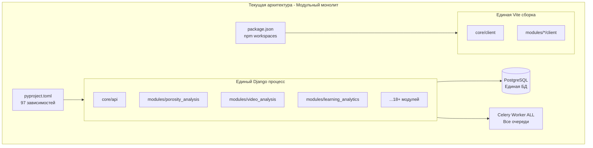
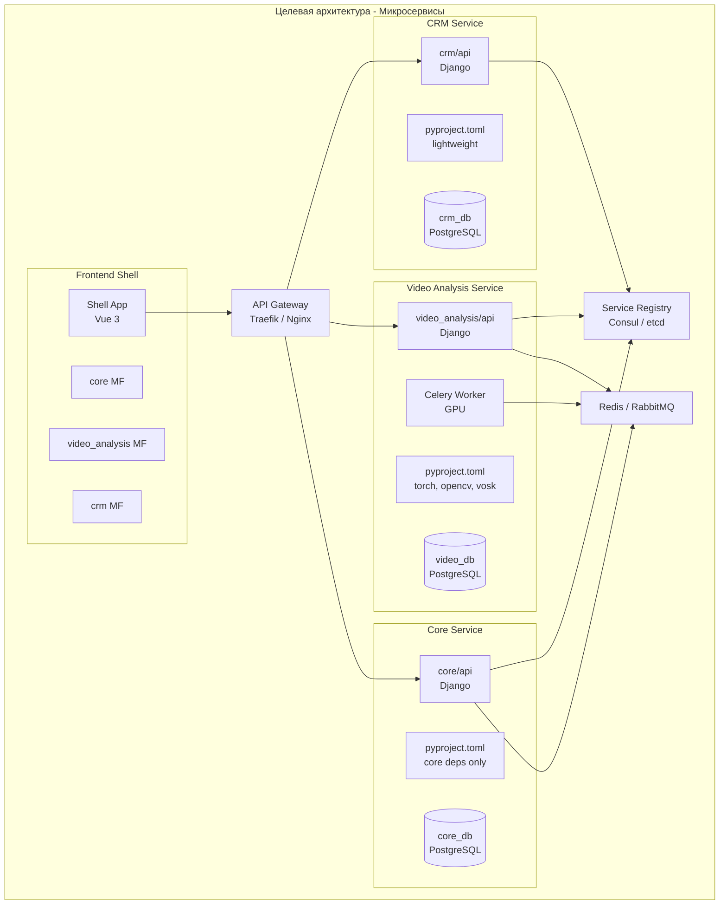

# Миграция ERGO MS в микросервисную архитектуру

## Текущее состояние: диагностика проблем

Система ERGO MS -- это **модульный монолит** с хорошими границами модулей (git submodules, convention-based auto-discovery), но с критическими архитектурными проблемами:




### Проблема 1: Единый `pyproject.toml` -- "God Dependency File"

Файл [pyproject.toml](pyproject.toml) содержит **97 зависимостей для всех модулей**, включая:

- torch + CUDA (3+ ГБ) -- нужен только `video_analysis`, `porosity_analysis`
- tensorflow (~1 ГБ) -- нужен только для ML-модулей
- vosk, moviepy, opencv -- нужен только `video_analysis`
- yfinance, feedparser -- нужен только `assets_analysis`
- mysqlclient, pyodbc, pymssql -- нужны только модулям с внешними БД

**Последствие**: установка зависимостей на сервер для одного модуля тянет за собой ВСЕ зависимости всех модулей (~15+ ГБ).

### Проблема 2: Единый `package.json` с пустыми модулями

Файл [package.json](package.json) определяет npm workspaces, но модули (например `modules/learning_analytics/client/package.json`) имеют **пустые зависимости** и полностью зависят от core/client. Невозможно собрать и задеплоить модуль отдельно.

### Проблема 3: Единый Django процесс

`ModuleDiscoverer` из [auto_config.py](core/api/src/core/utils/auto_api/auto_config.py) загружает ВСЕ модули в единый INSTALLED_APPS. Падение одного модуля роняет весь сервер. Масштабирование невозможно -- нельзя запустить `video_analysis` на GPU-сервере, а `crm` -- на обычном.

### Проблема 4: Единый Celery Worker

`celery_workers.yaml` определяет один worker `all` с 8 потоками для ВСЕХ очередей. Тяжелые ML-задачи блокируют легковесные задачи CRM/LMS.

### Проблема 5: Нет контейнеризации

Нет Dockerfiles, docker-compose, Kubernetes. Развертывание через NSSM/systemd не масштабируется.

---

## Целевая архитектура




---

## Фаза 1: Разделение зависимостей (pyproject.toml per module)

**Цель**: каждый модуль объявляет свои зависимости, core становится pip-пакетом.

### 1.1. Создать `ergo-core` как устанавливаемый пакет

Выделить core API utilities в пакет `ergo-core-sdk`:

```
core/api/
  pyproject.toml          # <-- НОВЫЙ: только core зависимости
  src/
    core/
      utils/              # Shared utilities
    config/               # Django settings
```

Пример `core/api/pyproject.toml`:

```toml
[tool.poetry]
name = "ergo-core-sdk"
version = "0.1.0"
packages = [{include = "src"}]

[tool.poetry.dependencies]
python = ">=3.12,<3.13"
django = {path = "../django", develop = true}
djangorestframework = {path = "../django_rest_framework", develop = true}
django-cors-headers = ">=4.7.0"
djangorestframework-simplejwt = ">=5.5.0"
drf-yasg = ">=1.21.10"
daphne = ">=4.2.1"
celery = ">=5.5.3"
channels = ">=4.2.2"
psycopg2 = ">=2.9.10"
pyyaml = ">=6.0.2"
django-environ = ">=0.12.0"
```

### 1.2. Каждый модуль получает свой `pyproject.toml`

Пример для `modules/video_analysis/pyproject.toml`:

```toml
[tool.poetry]
name = "ergo-video-analysis"
version = "0.1.0"
packages = [{include = "api"}]

[tool.poetry.dependencies]
python = ">=3.12,<3.13"
ergo-core-sdk = {path = "../../core/api", develop = true}
torch = {version = "==2.7.1+cu128", source = "pytorch-cu128"}
torchvision = {version = "==0.22.1+cu128", source = "pytorch-cu128"}
opencv-python = ">=4.12.0.88"
vosk = ">=0.3.45,<0.4.0"
moviepy = "==1.0.3"
```

### 1.3. Корневой `pyproject.toml` становится "meta-пакетом"

Корневой файл остается только для полной установки (dev-режим):

```toml
[tool.poetry.dependencies]
ergo-core-sdk = {path = "core/api", develop = true}
ergo-video-analysis = {path = "modules/video_analysis", develop = true, optional = true}
ergo-crm = {path = "modules/crm", develop = true, optional = true}

[tool.poetry.extras]
video = ["ergo-video-analysis"]
crm = ["ergo-crm"]
all = ["ergo-video-analysis", "ergo-crm", ...]
```

---

## Фаза 2: Разделение frontend зависимостей (package.json per module)

### 2.1. Модули получают реальные зависимости

Вместо пустых `package.json`, каждый модуль объявляет свои зависимости:

```json
// modules/video_analysis/client/package.json
{
  "name": "@ergo/video-analysis-client",
  "version": "0.1.0",
  "dependencies": {
    "video.js": "^8.0.0"
  },
  "peerDependencies": {
    "vue": "^3.5.0",
    "vue-router": "^4.5.0",
    "@ergo/core-client": "workspace:*"
  }
}
```

### 2.2. Core client как shared-пакет

```json
// core/client/package.json
{
  "name": "@ergo/core-client",
  "exports": {
    "./components/*": "./src/components/*",
    "./modules/*": "./src/modules/*",
    "./api": "./src/js/api/manager.js"
  }
}
```

---

## Фаза 3: Контейнеризация

### 3.1. Dockerfile для каждого сервиса

Создать шаблонную структуру:

```
core/api/Dockerfile
modules/video_analysis/Dockerfile
modules/crm/Dockerfile
docker-compose.yml
docker-compose.dev.yml
```

Пример `modules/video_analysis/Dockerfile`:

```dockerfile
FROM python:3.12-slim
WORKDIR /app
COPY modules/video_analysis/pyproject.toml .
RUN pip install poetry && poetry install --no-dev
COPY core/api/src/core/utils /app/core_utils
COPY modules/video_analysis/api /app/api
EXPOSE 8010
CMD ["daphne", "-b", "0.0.0.0", "-p", "8010", "config.asgi:application"]
```

### 3.2. Docker Compose для оркестрации

```yaml
# docker-compose.yml
services:
  traefik:
    image: traefik:v3
    ports: ["80:80", "443:443"]
    
  redis:
    image: redis:7-alpine
    
  core-api:
    build: {context: ., dockerfile: core/api/Dockerfile}
    environment:
      - DATABASE_URL=postgresql://...
    labels:
      - "traefik.http.routers.core.rule=PathPrefix(`/api/core`)"
      
  video-analysis:
    build: {context: ., dockerfile: modules/video_analysis/Dockerfile}
    deploy:
      resources:
        reservations:
          devices:
            - capabilities: [gpu]
    labels:
      - "traefik.http.routers.video.rule=PathPrefix(`/api/video_analysis`)"
      
  video-worker:
    build: {context: ., dockerfile: modules/video_analysis/Dockerfile}
    command: celery -A config worker -Q video_analysis
    deploy:
      resources:
        reservations:
          devices:
            - capabilities: [gpu]
```

---

## Фаза 4: Модификация `ModuleDiscoverer` для режима микросервиса

### 4.1. Режим работы: monolith vs microservice

Добавить переменную окружения `ERGO_MODE=monolith|microservice`:

В [auto_config.py](core/api/src/core/utils/auto_api/auto_config.py):

- `monolith` -- текущее поведение (все модули в одном процессе)
- `microservice` -- загружать только один модуль (из `ERGO_MODULE=video_analysis`)

```python
class ModuleDiscoverer:
    def __init__(self):
        self._cache = {}
        self._mode = os.environ.get('ERGO_MODE', 'monolith')
        self._module = os.environ.get('ERGO_MODULE', None)
    
    def _find_modules_apps(self, modules_dir, installed_apps):
        if self._mode == 'microservice' and self._module:
            # Загружать только указанный модуль
            module_path = os.path.join(modules_dir, self._module)
            if os.path.isdir(module_path):
                self._find_apps_in_api(...)
        else:
            # Текущее поведение -- все модули
            ...
```

### 4.2. Адаптация URL routing

В режиме `microservice` модуль регистрирует свои URL на корневом уровне (без префикса `modules/`), т.к. API Gateway добавит маршрутизацию.

---

## Фаза 5: Межсервисная коммуникация

### 5.1. Замена database-backed broker на Redis/RabbitMQ

Текущий Celery использует `sqla+postgresql://` как брокер -- это неэффективно для микросервисов. Перейти на Redis:

```python
# config/settings/celery.py
CELERY_BROKER_URL = os.environ.get('CELERY_BROKER_URL', 'redis://redis:6379/0')
CELERY_RESULT_BACKEND = os.environ.get('CELERY_RESULT_BACKEND', 'redis://redis:6379/1')
```

### 5.2. Межсервисные вызовы через REST API

Для случаев, когда модуль A вызывает модуль B, создать SDK-клиент:

```python
# core/api/src/core/utils/service_client.py
class ServiceClient:
    def __init__(self, service_name: str):
        self.base_url = os.environ.get(f'{service_name.upper()}_URL')
    
    async def call(self, endpoint: str, method='GET', data=None):
        # HTTP вызов к другому сервису через API Gateway
        ...
```

---

## Фаза 6: Micro-frontends (опционально, долгосрочная)

### 6.1. Module Federation через Vite

Каждый модуль собирается как remote-приложение, shell-app загружает их динамически. Это замена текущего `import.meta.glob` подхода.

Использовать `@originjs/vite-plugin-federation`:

```javascript
// modules/video_analysis/client/vite.config.js
import federation from '@originjs/vite-plugin-federation'

export default {
  plugins: [
    federation({
      name: 'videoAnalysis',
      filename: 'remoteEntry.js',
      exposes: {
        './routes': './js/routes.js',
        './endpoints': './js/endpoints.js'
      },
      shared: ['vue', 'vue-router', 'pinia']
    })
  ]
}
```

---

## Порядок миграции (приоритеты)

Миграция выполняется **инкрементально** -- система остается работоспособной на каждом этапе:

1. **Фаза 1** (pyproject.toml per module) -- **наивысший приоритет**, решает главную боль
2. **Фаза 4** (ERGO_MODE переключатель) -- позволяет запускать модуль изолированно
3. **Фаза 3** (Docker) -- контейнеризация каждого сервиса
4. **Фаза 5.1** (Redis broker) -- замена database-backed Celery
5. **Фаза 2** (package.json per module) -- разделение frontend зависимостей
6. **Фаза 5.2** (ServiceClient) -- межсервисное взаимодействие
7. **Фаза 6** (Micro-frontends) -- самая долгосрочная задача

---

## Ключевые файлы для изменений

- [pyproject.toml](pyproject.toml) -- разделить на per-module pyproject.toml
- [package.json](package.json) -- реальные зависимости для модулей
- [core/api/src/core/utils/auto_api/auto_config.py](core/api/src/core/utils/auto_api/auto_config.py) -- добавить ERGO_MODE
- [core/api/src/config/settings/celery.py](core/api/src/config/settings/celery.py) -- Redis broker
- [celery_workers.yaml](celery_workers.yaml) -- per-module workers
- [core/client/vite.config.js](core/client/vite.config.js) -- Module Federation
- Новые файлы: `Dockerfile` per module, `docker-compose.yml`, `core/api/src/core/utils/service_client.py`

