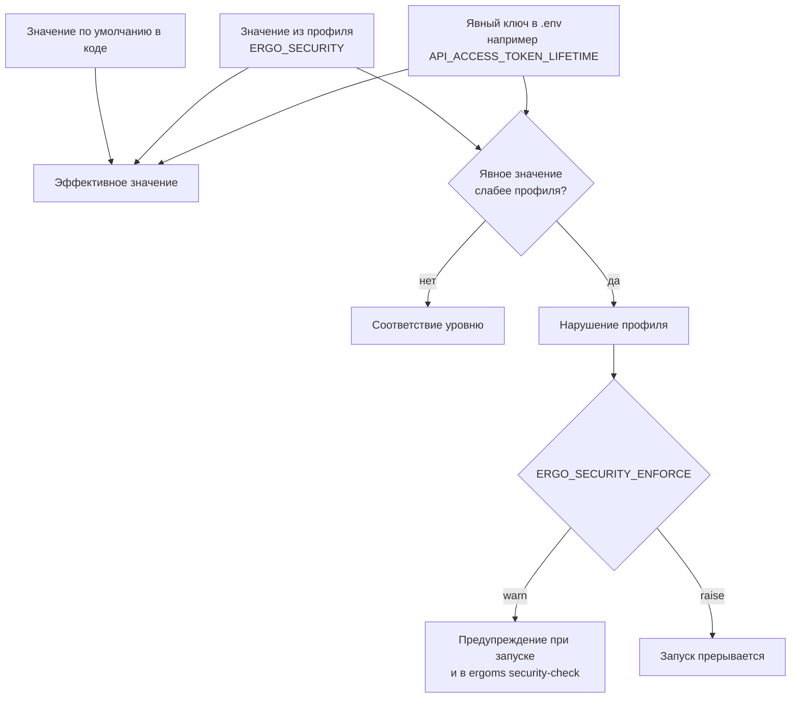

# Режимы безопасности

Документ описывает градацию режимов безопасности ERGO MS: четыре уровня, каталог контролей, команды проверки и дальнейшее применение профиля.

**Этап 0 реализован (отчётный):** каталог [`core/deployment/security/profiles.yaml`](../core/deployment/security/profiles.yaml), вычисление `ERGO_SECURITY` / `ERGO_SECURITY_ENFORCE` в [`ergo_modes.py`](../core/deployment/ergo_modes.py), команды `ergoms security-modes` и `ergoms security-check`.

**Этап 1 реализован (честный `standard`):** каталог отражает реальные проверки (`password_policy`, `jupyter_exposure`, `anonymous_endpoints`, `client_browser_log` и др.); login throttle читается из `API_THROTTLE_RATES_LOGIN` (дефолт кода `5/minute`); лимит размера WS — `API_REALTIME_MAX_MESSAGE_BYTES`. Вне скоупа этапа 1: **К3** (перепись шаблонных секретов в `*.example`) и **В5** (пароль Redis).

**Этап 2 реализован (apply профиля):** [`profile_defaults.merge_security_profile_defaults`](../core/deployment/security/profile_defaults.py) подставляет скаляры из каталога только для **незаданных** env-ключей; явный `.env` побеждает; профиль **не пишет** `.env`. Runtime API — [`security_profile_runtime.py`](../core/api/src/config/security_profile_runtime.py); media — те же ключи после загрузки env. `API_ACCESS_TOKEN_LIFETIME` остаётся check-only (дефолт кода 30). Вне скоупа: **К3**, **В5**, MFA/CSP, этап 4. Этапы 3–4 — в разделе [Поэтапное внедрение](#поэтапное-внедрение); решения этапа 0 — в [Решения этапа 0](#решения-этапа-0).

Текущее состояние безопасности ядра и перечень отклонений — в документе [Аудит безопасности ядра](security-audit.md).

## Зачем нужны уровни

Сейчас безопасность установки складывается примерно из сорока независимых переменных в `.env` и во фрагментах `env/`: сроки жизни токенов, ограничения частоты запросов, режим регистрации, политика паролей, доступность документации API, срок хранения журнала аудита, параметры Redis и nginx. У этого набора три недостатка.

Во-первых, **человек, разворачивающий систему, не знает, какие значения безопасны**. Шаблон `.env.example` рассчитан на первый запуск: регистрация по умолчанию открыта, а документация API и HTML-формы DRF включаются кодом только в development (если переменные не заданы). Остальные чувствительные параметры (CORS в production, сроки JWT, throttle) частично уже ужесточены в шаблоне и коде; полный согласованный переключатель уровней — цель этого документа.

Во-вторых, **отдельные переменные не связаны между собой**. Можно включить работу за обратным прокси с шифрованием, но оставить бессрочные токены; можно потребовать сложные пароли, но оставить восстановление по шестизначному коду без ограничения попыток. Согласованность целиком на совести администратора.

В-третьих, **у разных установок разные требования**. Внутренний инструмент небольшой команды и система, работающая с персональными данными, не должны настраиваться одинаково. При этом набор подключённых модулей влияет на то, какой уровень вообще достижим: модуль с публичной формой приёма заявок не может работать там, где запрещены анонимные эндпоинты.

Уровень безопасности решает все три задачи: задаёт согласованный набор значений одним переключателем, документирует, что именно этот набор гарантирует, и позволяет заранее проверить, совместим ли выбранный уровень с подключёнными модулями.

## Градация

Уровни упорядочены: каждый следующий включает всё, что требует предыдущий, и добавляет свои требования.

| Уровень | Ранг | Для чего |
|---|---|---|
| `open` | 0 | Локальная разработка, демонстрации, обучающие стенды. Максимум удобства: документация API, просмотр эндпоинтов в браузере, длинные сроки жизни токенов, мягкие лимиты. Запрещён при `ERGO_ENV=production`. |
| `standard` | 1 | Значение по умолчанию. Рабочий минимум, ниже которого не должна опускаться ни одна установка: отдельный лимит на попытки входа, привязка сессии к устройству, запрет доступа по умолчанию там, где права не объявлены, документация API закрыта вне разработки, шаблонные секреты не принимаются. |
| `hardened` | 2 | Эксплуатация с чувствительными данными. Добавляет короткие сроки жизни, обязательное шифрование канала, строгую политику содержимого страниц, пароль у Redis, обязательный журнал аудита с ненулевым сроком хранения, регистрацию только по приглашению. Ротация refresh и отзыв при выходе уже входят в `standard`. |
| `maximum` | 3 | Работа под внешними требованиями к защите информации. Добавляет обязательный второй фактор, минимальные сроки жизни токенов, проверку содержимого загружаемых файлов, аудит операций чтения и полный запрет анонимных эндпоинтов, кроме входа и проверки состояния. Несоответствие прерывает запуск. |

### Как выбрать уровень

| Сценарий | Уровень |
|---|---|
| Разработка на своей машине, база с тестовыми данными | `open` |
| Общий стенд команды, доступен только из внутренней сети | `standard` |
| Рабочая система с реальными данными сотрудников | `hardened` |
| Система с персональными данными или иными сведениями ограниченного доступа | `maximum` |
| Публичный сервис с самостоятельной регистрацией пользователей | `hardened`, регистрация по приглашению отключается осознанно с записью исключения |

Уровень выбирается **по самым чувствительным данным в системе**, а не по количеству пользователей. Небольшая установка на пять человек, где хранятся сканы документов, требует `hardened`, а внутренний справочник на двести человек может остаться на `standard`.

## Настройка в `.env`

Переключатель добавляется в блок режимов корневого `.env` рядом с существующими:

```dotenv
# --- Режимы ---
ERGO_RUNTIME=host
ERGO_PROXY=none
ERGO_BROKER=local
ERGO_DB=portable_postgres
ERGO_ENV=development
# Уровень безопасности: open (разработка) | standard | hardened | maximum
ERGO_SECURITY=standard
# Реакция на несоответствие уровню: off (молча) | warn (предупреждение) | raise (прерывать запуск)
ERGO_SECURITY_ENFORCE=warn
```

Это девятый ортогональный режим в ряду `ERGO_*`, поэтому он подчиняется тем же соглашениям, что и остальные: значение приводится к нижнему регистру, неизвестное значение заменяется значением по умолчанию, вычисление эффективных величин собрано в [core/deployment/ergo_modes.py](../core/deployment/ergo_modes.py).

Значение `ERGO_SECURITY_ENFORCE` работает так же, как уже существующий переключатель изоляции модулей `BRIDGE_ISOLATION`, и определяет **реакцию** на нарушение, но не его значимость: `off` — нарушения не сообщаются, `warn` — выводятся в консоль при запуске, но работа продолжается, `raise` — нарушения со значимостью «ошибка» прерывают запуск. Значимость каждого нарушения задана в каталоге контролей полем `violation`. На уровне `maximum` реакция принудительно считается равной `raise`, иначе строгий уровень не даёт гарантий.

Сочетание уровня с режимом системы проверяется отдельно: `ERGO_SECURITY=open` при `ERGO_ENV=production` — ошибка, а не предупреждение.

## Каталог контролей

**Контроль** — это одно проверяемое требование: значение переменной окружения, признак включения возможности или правило, которому должен соответствовать код. Каталог контролей ядра хранится в файле `core/deployment/security/profiles.yaml` — обычном описании без исполняемого кода, чтобы его читали и команды `ergoms`, и настройки сервера.

Описание одного контроля:

```yaml
controls:
  - id: auth.login_throttle
    layer: api                       # api | client | media | realtime | deployment
    title: Ограничение частоты попыток входа
    env_key: API_THROTTLE_RATES_LOGIN
    kind: value                      # value | switch | policy
    profiles:
      open: 100/minute
      standard: 10/minute
      hardened: 5/minute
      maximum: 5/minute
    violation: error                 # error | warning
    waivable: false                  # может ли модуль объявить исключение
```

Поле `kind` определяет, как контроль проверяется и применяется:

- `value` — у контроля есть значение, которое подставляется в настройки, если соответствующий ключ не задан человеком явно;
- `switch` — возможность включена или выключена (документация API, ротация токенов, проверка источника соединения);
- `policy` — требование к коду или к процессу, которое нельзя выразить одной переменной (объектные проверки прав, отсутствие анонимных эндпоинтов вне списка); такие контроли проверяются статически и не имеют эффективного значения.

### Аутентификация и сессии

| Контроль | `open` | `standard` | `hardened` | `maximum` |
|---|---|---|---|---|
| `auth.login_throttle` | 100/мин | 5/мин | 5/мин | 5/мин |
| `auth.lockout` | нет | нет | 10 неудач | 5 неудач |
| `auth.reset_code_policy` | без ограничений | срок 15 мин, 5 попыток | срок 10 мин, 3 попытки | восстановление только администратором |
| `auth.mfa_required` | нет | нет | по выбору пользователя | обязателен |
| `session.device_binding` | можно отключить | обязательна на всех эндпоинтах | обязательна | обязательна |
| `session.revoke_on_password_change` | нет | да | да | да |
| `session.device_retention` | не ограничено | не ограничено | 90 дней | 30 дней |
| `token.lifetime_required` | можно отключить срок | срок обязателен | обязателен | обязателен |
| `token.access_ttl_max` | без границы | 60 мин | 30 мин | 15 мин |
| `token.remember_me_max` | 7 суток | 7 суток | 24 часа | запрещено |
| `token.rotate_refresh` | нет | да | да | да |
| `token.revoke_on_logout` | нет | да | да | да |

### Права доступа и поверхность API

| Контроль | `open` | `standard` | `hardened` | `maximum` |
|---|---|---|---|---|
| `api.default_permission` | требуется вход | требуется вход | требуется вход | требуется вход |
| `api.anonymous_endpoints` | без ограничений | базовый список ядра | базовый список и исключения модулей с обоснованием | только вход и проверка состояния |
| `api.admin_only_bulk_ops` | рекомендуется | обязательно | обязательно | обязательно |
| `api.task_status_owner` | нет | да | да | да |
| `api.object_permissions` | нет | нет | обязательны для чужих данных | обязательны и проверяются автоматически |
| `api.docs_exposure` | документация открыта | закрыта вне разработки | закрыта | маршруты не регистрируются |
| `api.public_id_only` | рекомендуется | рекомендуется | обязательно | обязательно |
| `adp.default_role_view_grants` | выдаются | выдаются | не выдаются | не выдаются |
| `registration.mode` | любой | любой | по приглашению или закрыта | закрыта |
| `password.policy` | не менее 6 знаков | не менее 8, цифра и строчная буква | не менее 12, заглавная и специальный знак | не менее 14 и проверка по списку скомпрометированных |

### Транспорт и заголовки

| Контроль | `open` | `standard` | `hardened` | `maximum` |
|---|---|---|---|---|
| `transport.https_required` | нет | нет | да, вместе с HSTS и защищёнными cookie | да, включая перенаправление с HTTP |
| `cors.explicit_origins` | список для разработки | явный список в production | явный список всегда | явный список, шаблоны запрещены |
| `csrf.trusted_origins` | можно пусто | явный список в production | явный список в production | явный список всегда |
| `csp.strict` | как есть | как есть | без `unsafe-eval` и `unsafe-inline` | плюс явный список внешних источников |
| `headers.baseline` | включены | включены | включены | включены |

Контроль `cors.explicit_origins` на уровне `standard` уже отражён в коде: [`cors.py`](../core/api/src/config/settings/cors.py) подставляет localhost только при `ERGO_ENV=development` и прерывает запуск в production без `CORS_ALLOWED_ORIGINS` / `CORS_ALLOWED_ORIGIN_REGEXES` (пока без отдельной переменной `ERGO_SECURITY`).

Контроль `csrf.trusted_origins` — аналогично: [`csrf.py`](../core/api/src/config/settings/csrf.py) допускает пустой список только в development; вне development без `CSRF_TRUSTED_ORIGINS` — `ImproperlyConfigured`.

### Realtime

| Контроль | `open` | `standard` | `hardened` | `maximum` |
|---|---|---|---|---|
| `realtime.token_type` | любой действительный | только access | только access | только access |
| `realtime.origin_validation` | нет | да | да | да |
| `realtime.device_binding` | нет | да | да | да |
| `realtime.message_limits` | нет | ограничение размера | размер и частота | размер, частота и разрыв соединения при превышении |
| `messenger.access_default` | доступ разрешён | доступ запрещён | запрещён | запрещён |

### Файлы

| Контроль | `open` | `standard` | `hardened` | `maximum` |
|---|---|---|---|---|
| `media.signed_urls_ttl` | 3600 с | 3600 с | 900 с | 300 с |
| `media.content_validation` | расширение | расширение | расширение и сигнатура содержимого | плюс антивирусная проверка |
| `media.upload_rate` | выключено в отладке | 30/мин | 15/мин | 10/мин |
| `internal.write_size_limit` | нет | обязателен | обязателен | обязателен |
| `internal.trusted_proxies` | не проверяется | не проверяется | обязателен список доверенных прокси | плюс отдельный ключ для внутреннего API |

### Инфраструктура и данные

| Контроль | `open` | `standard` | `hardened` | `maximum` |
|---|---|---|---|---|
| `secrets.no_defaults` | шаблонное значение допускается | шаблонное значение запрещено | запрещено, проверяется длина ключа | плюс отдельный ключ подписи токенов |
| `broker.redis_password` | не требуется | рекомендуется | обязателен | обязателен, порт не публикуется |
| `deploy.docker_nginx_parity` | не требуется | не требуется | обязателен | обязателен |
| `jupyter.exposure` | любой | не доступен из сети без пароля | только локально или через прокси с авторизацией | выключен |
| `logging.client_browser` | включён | включён | включён без персональных данных | выключен |
| `audit.retention_min` | не задан | не задан | 90 дней | 365 дней и аудит операций чтения |

## Как вычисляется эффективное значение



Правила приоритета:

1. **Явно заданный ключ в `.env` побеждает.** Это то же поведение, что у существующих режимов: `NGINX_ENABLED` перекрывает `ERGO_PROXY`, `MEDIA_ACCESS_MODE` перекрывает `ERGO_MEDIA`. Администратор всегда может настроить систему точнее, чем это делает профиль.
2. **Если ключ не задан, берётся значение профиля.** Именно так уровень настраивает установку одним переключателем.
3. **Если ни того, ни другого нет, остаётся значение по умолчанию из кода.** Профиль не обязан описывать все переменные.
4. **Ослабление не проходит молча.** Здесь поведение сознательно отличается от остальных режимов `ERGO_*`: если явно заданное значение слабее требуемого профилем, это фиксируется как нарушение. Иначе уровень давал бы ложное чувство защиты — переменная, забытая в файле полгода назад, тихо отменяла бы половину профиля.

Профиль **никогда не записывает значения в `.env`**. Файлы окружения редактирует только человек — это общее правило проекта. Команды проверки лишь показывают расхождения и подсказывают, что изменить.

### Где применяются значения

| Уровень системы | Что делает | Файл |
|---|---|---|
| Команды `ergoms` | вычисляют уровень и эффективные значения без Django | `ergo_security()` и `effective_security_*` в [core/deployment/ergo_modes.py](../core/deployment/ergo_modes.py) |
| Сервер | превращает контроли в настройки Django и DRF | новый `core/api/src/config/security_profile_runtime.py` рядом с существующими `nginx_runtime.py` и `redis_runtime.py`, потребитель — `core/api/src/config/settings/security_profile.py` |
| Media API | сроки подписанных ссылок, лимиты загрузки, требования к внутреннему API | настройки в `core/media_api/src/media_server/settings/` |
| Клиент | уровень журналирования, карты исходного кода, клиентский мониторинг | сборка Vite, значения подставляются при `ergoms client-build` |

Разделение важно: команды развёртывания читают уровень **до** запуска Django, поэтому вычисление уровня живёт в `core/deployment` и не зависит от настроек сервера. Сервер и media_api используют те же значения через собственные модули эффективных значений.

## Требования модуля

Модуль объявляет свои требования файлом `modules/<имя>/security.yaml`. Ядро не знает имён модулей: оно сканирует установленные модули через `ModuleCatalog` и читает файл с фиксированным именем — тот же приём, что уже используется для ролей процессов (`process_roles.yaml`), жизненного цикла служб (`host_lifecycle.yaml`) и переносимых пакетов (`packages.yaml`). Загрузчик — `core/deployment/scripts/security_requirements_loader.py` по образцу `process_roles_loader.py`.

```yaml
module: <name>
# Диапазон уровней, на которых модуль работает корректно
supported:
  min: standard
  max: hardened

# Послабления, без которых модуль не работает
requires:
  - control: api.anonymous_endpoints
    reason: публичная форма приёма заявок без входа в систему
    endpoints:
      - /api/<name>/public/lead/
  - control: media.content_validation
    reason: приём чертежей в формате, у которого нет устойчивой сигнатуры
    values: [dxf]

# Усиления, которые модуль обеспечивает сам
provides:
  - control: audit.domain_events
    reason: все операции с договорами записываются в журнал аудита
```

Поля означают следующее:

- `supported.min` — уровень, ниже которого модуль **небезопасен**: например, модуль, работающий с платёжными данными, объявляет `hardened` и тем самым не даёт установить систему на `standard`, пока он подключён.
- `supported.max` — уровень, выше которого модуль **не работает**: обычно из-за того, что ему нужно послабление, которое строгий уровень запрещает.
- `requires` — конкретные послабления с обязательным обоснованием на русском языке; обоснование попадает в отчёт проверки, поэтому его читают люди, а не только программы.
- `provides` — сведения о том, что модуль сам закрывает часть требований. На вычисление уровня не влияет, но отображается в отчёте: администратор видит, что журнал аудита ведётся не только ядром.

Отсутствие файла означает, что модуль совместим с любым уровнем и послаблений не просит. Битый или неполный файл — предупреждение, а не отказ, чтобы одна ошибка в модуле не блокировала работу команд развёртывания.

### Алгоритм проверки совместимости

1. Вычисляется эффективный уровень и его ранг.
2. Для каждого подключённого модуля сравниваются ранги: уровень ниже `supported.min` — ошибка с указанием, какой уровень нужен; выше `supported.max` — ошибка с указанием, какое послабление мешает.
3. Каждое требование из `requires` сверяется с каталогом контролей. Если контроль на этом уровне допускает исключения (`waivable: true`), выводится предупреждение с обоснованием модуля. Если не допускает — ошибка.
4. Конфликты между модулями показываются целиком: один модуль требует уровень не ниже `hardened`, другой не работает выше `standard` — в отчёте видны оба, а не только первый.
5. Отдельно проверяется код: анонимные эндпоинты без объявленного исключения, переопределение классов аутентификации, области ограничения частоты без подключённого класса. Часть этих проверок логично добавить к уже существующей команде `ergoms core-rules-check`.

## Команды проверки

| Команда | Что делает |
|---|---|
| `ergoms security-modes` | Показывает таблицу уровней, текущий эффективный уровень и то, что он требует. Справочная команда без кода возврата. |
| `ergoms security-check` | Сверяет три источника — значения `.env`, требования модулей и признаки в коде — и выводит отчёт. Код возврата: 0 — нарушений нет, 1 — есть предупреждения, 2 — есть ошибки. |
| `ergoms security-check --profile hardened` | Предварительный расчёт: что произойдёт при переходе на другой уровень. Ничего не меняет, отвечает на вопрос «можно ли нам перейти» до перехода, а не после. |

Вывод оформляется принятыми в проекте метками, текст берётся из каталога локализации команд:

```text
Уровень безопасности: hardened (ERGO_SECURITY), реакция: warn

[OK]      auth.login_throttle — 5/minute
[OK]      session.device_binding — включена
[WARNING] token.remember_me_max — задано 10080 мин, уровень требует не более 1440
[ERROR]   secrets.no_defaults — API_SECRET_KEY совпадает со значением из шаблона
[WARNING] <name>: api.anonymous_endpoints — публичная форма приёма заявок (исключение принято)
[ERROR]   <other>: требуется уровень не ниже maximum, установлен hardened

Итого: 2 ошибки, 2 предупреждения
```

Команду имеет смысл вызывать в трёх местах: в конце первичной настройки `setup-full` (как подсказку), перед установкой системных служб (с предупреждением) и в проверках перед выпуском версии.

## Чего режимы не делают

Уровень безопасности — это согласованная настройка приложения, и только. Он не заменяет:

- обновление зависимостей и отслеживание уязвимостей в них;
- настройку сети, межсетевого экрана и прав доступа к файлам на сервере;
- резервное копирование и проверку восстановления;
- организационные меры: управление учётными записями, разбор инцидентов, обучение сотрудников.

Уровень `maximum` не является подтверждением соответствия каким-либо внешним требованиям. Он лишь приводит настройки приложения в состояние, которое обычно необходимо для такого соответствия.

## Поэтапное внедрение

Уровень нельзя включить одномоментно: `standard` требует изменений в коде ядра, которые описаны в [отчёте по аудиту](security-audit.md).

| Этап | Содержание | Результат |
|---|---|---|
| 0 | **Сделано.** Каталог контролей, вычисление уровня, команды `security-modes` и `security-check`. Профиль **ничего не меняет** в работе системы. | Любая установка может узнать, какому уровню она соответствует. |
| 1 | **Сделано.** Честный отчёт для `standard`: truth-up каталога, checkers политики паролей / Jupyter / анонимных эндпоинтов / browser-log, env для login throttle и лимита размера realtime. **К3** и **В5** вне скоупа. | `ergoms security-check` не помечает закрытые контроли как SKIP; ядро соответствует `standard` по реализованным контролям. |
| 2 | **Сделано.** Профиль подставляет эффективные значения там, где ключ не задан (`profile_defaults` + runtime API/media). Новые установки получают `ERGO_SECURITY=standard` в шаблоне. Профиль не пишет `.env`. | Уровень влияет на работу системы. |
| 3 | Контроли уровней `hardened` и `maximum`: второй фактор, строгая политика содержимого, проверка содержимого файлов, аудит операций чтения. Ротация refresh и отзыв при logout закрыты на этапе 1 (В6) и входят в `standard`. | Доступны все четыре уровня. |
| 4 | Файлы `security.yaml` у модулей, проверка совместимости, правило `.cursor/rules/security-modes.mdc`, раздел в [Настройке конфигурации](configuration.md). | Уровень выбирается с учётом подключённых модулей. |

Совместимость с уже работающими установками обеспечивается порядком этапов: до этапа 2 профиль ничего не меняет, а после — уровень по умолчанию остаётся `standard`, и любое расхождение сначала выводится предупреждением, а не прерывает запуск.

## Решения этапа 0

| Вопрос | Решение |
|---|---|
| Имена уровней | `open` / `standard` / `hardened` / `maximum` |
| Waivers админа | Отложены (этап 4+); поле `waivable` в каталоге есть, резолва нет |
| `maximum` без MFA | Контроль `auth.mfa_required` со `status: planned`; check даёт SKIP |
| Клиент vs runtime | Собранный клиент на этапе 0 не проверяется |
| Нет `ERGO_SECURITY` в `.env` | Эффективный уровень = `standard` (в отчёте: «по умолчанию») |
| Модули `security.yaml` | Вне скоупа этапа 0 |
| Применение значений профиля | **Сделано** (этап 2): merge unset-ключей; `.env` не пишется |

## Вопросы к обсуждению (этапы 2–4)

1. **Исключения администратора** — допускать ли `security.waivers.yaml` и на каких уровнях.
2. **Уровень `maximum` без второго фактора** — жёстко требовать MFA или временно `violation: warning` до реализации.
3. **Влияние на клиент** — проверять ли соответствие собранного клиента текущему уровню при запуске.
